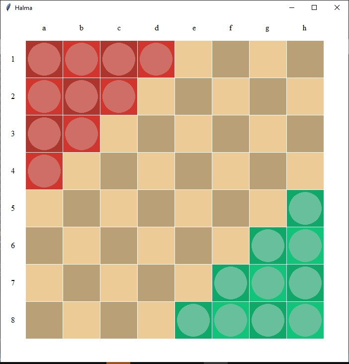
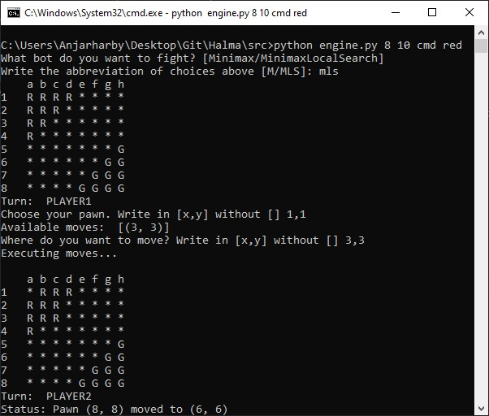

# Halma
Halma board game implementation using minimax & alpha beta pruning, and local search for IF3170 Artificial Intelligence

## Created by
1. 13518013	Raras Pradnya Pramudita
2. 13518016	Indra Febrio Nugroho
3. 13518088	Ananda Yulizar Muhammad
4. 13518143	Yasyfiana Fariha Putrisusari

## Running the program

### Prerequisites
* Python 3
* tkinter library

### Things to note
This program were made and run in Windows OS. You might need to adapt it into your own computer OS to run the program

### Step by step
* go to `src` folder
* open terminal
* type this in
`python engine.py boardsize timelimit gamesystem playercolor`
_boardsize_: should be 8, 10, or 16
_timelimit_: any number in integer (in second)
_gamesystem_: should be CMD or GUI
_playercolor_: should be RED or GREEN. Leave it blank if you want to run bot minimax vs bot minimax-local search

## Application Screenshot
GUI

CMD

**Curious to know more? Let's try it yourself and join the fun!**

## Credits

[python](https://www.python.org/)
[tkinter](https://docs.python.org/3/library/tkinter.html)